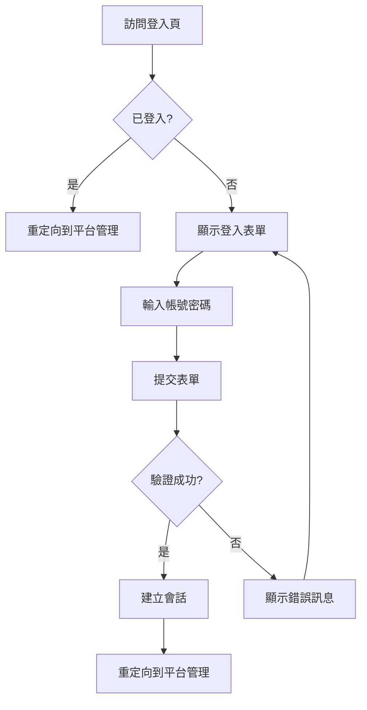

# 登入頁面說明

## 概述

Camera Cloud 系統現在擁有一個專業的網頁登入介面，設計靈感來自 [兌心科技有限公司 Insight Software](https://www.insight-software.com/)。

## 設計特色

### 視覺設計
- **現代漸層背景**: 紫藍色漸層（#667eea 到 #764ba2）營造科技感
- **雙欄式佈局**: 左側品牌宣傳，右側登入表單
- **玻璃擬態效果**: 半透明背景加模糊效果
- **響應式設計**: 完美支援桌面和行動裝置

### 品牌元素
- **網站標題**: Insight Software Portals
- **Logo**: 大型 "Insight" 字樣配漸層效果
- **Slogan**: 新世代數位解決方案商

### 功能特色
1. **系統特點展示**:
   - ✓ 雲端運算與 AI 技術整合
   - ✓ 企業級安全防護機制
   - ✓ 多平台管理控制中心
   - ✓ 即時監控與分析報表

2. **使用者體驗**:
   - 輸入框聚焦動畫效果
   - 登入按鈕 hover 動畫
   - 自動隱藏錯誤訊息（5秒後）
   - 記住我功能
   - 忘記密碼連結（待實作）

3. **錯誤處理**:
   - 友善的錯誤訊息顯示
   - 登出成功提示
   - 載入動畫效果

## 訪問方式

### 1. 直接訪問登入頁
```
http://localhost:8080/login
```

### 2. 訪問根路徑自動重定向
```
http://localhost:8080/
```
會自動重定向到登入頁面（未登入時）

### 3. 訪問管理API自動跳轉
當未登入時訪問任何受保護的 API 端點，會自動重定向到登入頁面：
```
http://localhost:8080/api/v1/admin/platforms
```

## 預設帳號

### 主要管理員
- **帳號**: `admin`
- **密碼**: `admin123`
- **權限**: MAIN_ADMIN（完整權限）

### 平台管理員
- **帳號**: `platform_admin`
- **密碼**: `platform123`
- **權限**: PLATFORM_ADMIN（受限權限）

## 技術實現

### 前端技術
- **Pure HTML/CSS**: 無需額外前端框架
- **Thymeleaf**: 伺服器端模板引擎
- **自適應設計**: Flexbox 佈局
- **CSS 動畫**: 流暢的互動效果

### 後端整合
- **Spring Security**: 表單登入處理
- **Session 管理**: Cookie-based 會話管理
- **CSRF 保護**: 表單 CSRF token 驗證
- **登出功能**: 清除會話和 Cookie

## 安全特性

1. **CSRF 防護**: 所有表單自動包含 CSRF token
2. **密碼保護**: BCrypt 加密儲存
3. **會話管理**: 登出時完全清除會話
4. **安全標頭**: HSTS, X-Frame-Options 等

## 自定義配置

### 修改登入頁樣式
編輯檔案：
```
src/main/resources/templates/login.html
```

### 修改登入邏輯
編輯檔案：
```
src/main/java/com/example/cameracloud/config/SecurityConfig.java
```

### 更改預設密碼
編輯 `application.yaml`:
```yaml
spring:
  security:
    user:
      password: ${ADMIN_PASSWORD:your_new_password}
```

或使用環境變數：
```bash
export ADMIN_PASSWORD=your_secure_password
./mvnw spring-boot:run
```

## 登入流程



## 登出流程

點擊登出按鈕（或訪問 `/logout`）：
1. 清除當前會話
2. 刪除 JSESSIONID Cookie
3. 重定向到登入頁
4. 顯示登出成功訊息

## 螢幕截圖說明

### 桌面版
- 雙欄式佈局
- 左側：品牌宣傳和特色列表
- 右側：登入表單

### 行動版
- 單欄堆疊佈局
- 先顯示品牌區域
- 後顯示登入表單

## 瀏覽器支援

- ✅ Chrome 90+
- ✅ Firefox 88+
- ✅ Safari 14+
- ✅ Edge 90+
- ✅ 所有現代行動瀏覽器

## 國際化

目前支援：
- 🇹🇼 繁體中文（預設）

未來可擴展：
- 🇬🇧 English
- 🇨🇳 简体中文
- 🇯🇵 日本語

## 相關連結

- [兌心科技官網](https://www.insight-software.com/)
- [專案 README](README.md)
- [快速開始指南](QUICKSTART.md)
- [實施總結](IMPLEMENTATION_SUMMARY.md)

## 疑難排解

### 問題：登入後立即登出
**解決方案**: 檢查 Cookie 設定，確保瀏覽器允許 Cookie

### 問題：CSRF token 錯誤
**解決方案**: 清除瀏覽器快取和 Cookie，重新訪問登入頁

### 問題：密碼正確但無法登入
**解決方案**: 檢查帳號是否正確，注意大小寫

### 問題：登入頁樣式跑版
**解決方案**: 確保使用現代瀏覽器，清除瀏覽器快取

## 未來改進計畫

- [ ] 雙因素認證（2FA）
- [ ] 社交媒體登入（Google, Facebook）
- [ ] 忘記密碼功能
- [ ] 帳號註冊功能
- [ ] 多語言支援
- [ ] 深色模式
- [ ] 登入歷史記錄

## 授權聲明

介面設計靈感來自 [兌心科技有限公司 Insight Software](https://www.insight-software.com/)

© 2025 Insight Software. All Rights Reserved.


